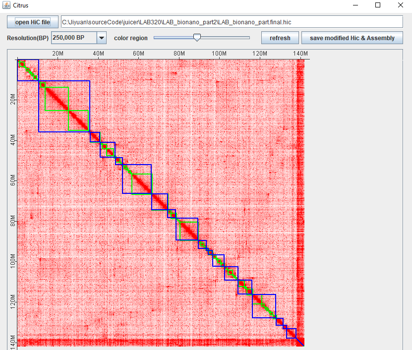
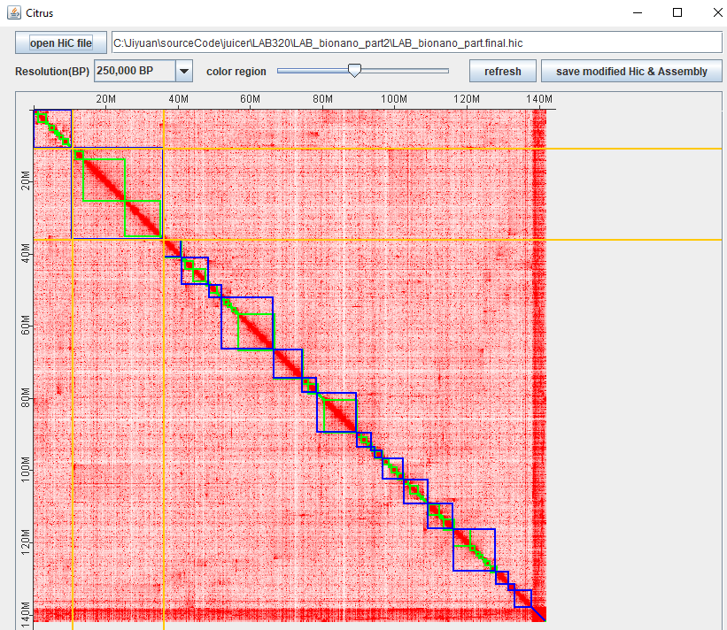
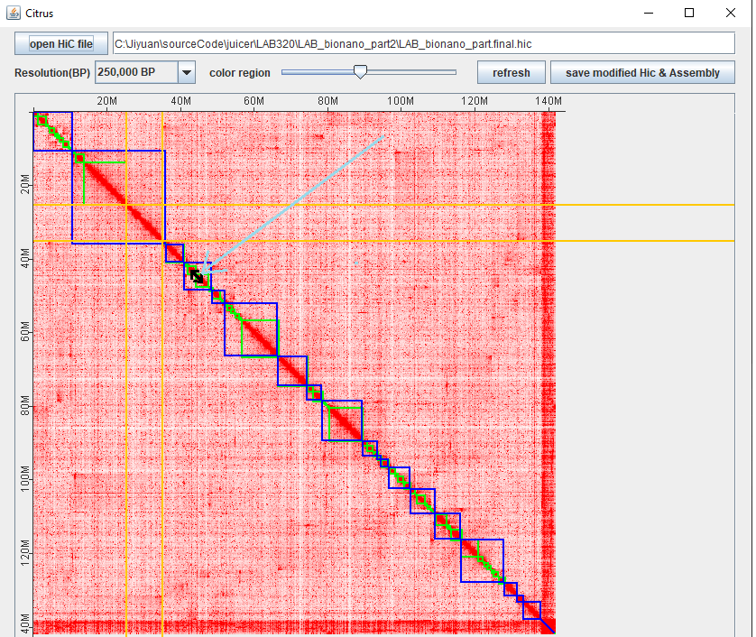
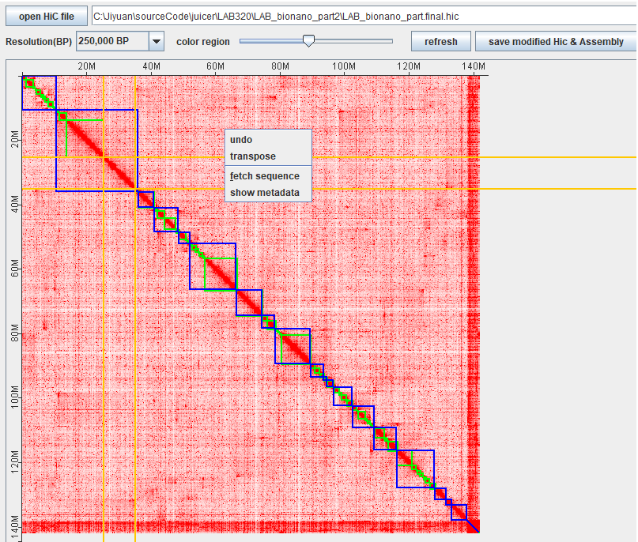
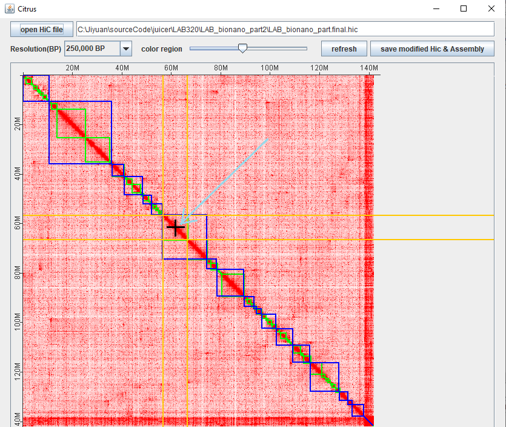

# Citrus: Editing HiC data for de novo genome assembly
[juicer](https://github.com/aidenlab/juicer) and [3D-DNA](https://github.com/aidenlab/3d-dna) 
are two tools that re-arrange HiC data (xxx.hic format) and 
split/re-order super-scaffold data(xxx.assembly) to imporve de novo assembly. [juicebox](https://github.com/aidenlab/Juicebox) was specifically
designed to tune
or adjuste genomic sequences based on on the HiC data. However, the current 
Juicebox version does not have a function to save updated Hic data and 
summraize chromosome sequences. Thus we created 
Citrus which can edit super-scaffolds according to chromatin conformation data captured 
in xxx.hic. Citrus updates HiC and assemble and chromosome level sequences.
## quick start
1. run Citrus
    1. **Linux or MacOs:**  > bash Citrus.sh
    2. **windows:** double click Citrus.bat
2. outlook of Citrus
    
    after starting Citrus, the figure above is generated, "**Resolution(BP)**" dropdown menu 
Zooms in/out Hic data. "**refresh**" button is clicked to make the changes. 
The slider bar of "**color range**" changes the depth of color.
3. Selecting block/blocks of interest
    1. Press shift + mouse-left-click: select one block (green block)
       
    2. control + mouse-left-click: select one chromosome block (blue block)
       
4. Moving the block?
    1. Locate the cursor to insert. If the cursor covers more than one edge of the block, the popup 
   window "multi blocks in the area" appears. This indicates a higher resolution is needed. When 
   two ends of the arrow appears, left click to insert the selected block.
       
5. Transposing a block and retriving sequences of the selected block?
    1. After selecting the blocks, right-clicking the mouse shows the menu to of various functions for
the selected block.
       
6. Spilting one blocks?
    1. After selecting the blocks, move the mouse cursor on the  diagonal line in the block. 
The cursor then changes to a cross and left clicking the mouse will split the block into two.
       
